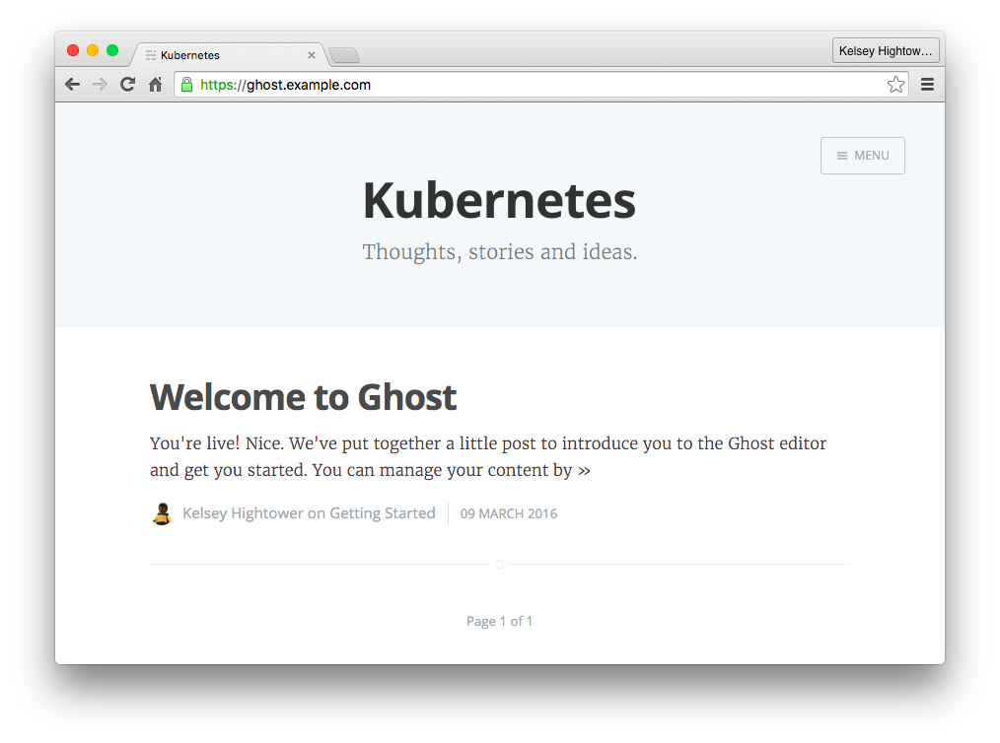

# Kubernetes 1.2 Demo (Ghost)

This tutorial will walk you through deploying [Ghost](https://ghost.org),
A publishing platform for professional bloggers, using Kubernetes 1.2 features.
This is the live demo that was given at KubeCon EU 2016.

 

## Prerequisites 

### Database

Create a [Cloud SQL database instance](https://cloud.google.com/sql/docs/create-instance).

#### Create the Ghost user and database

Login to the mysql instance:

```
mysql -u root -p -h <cloud-sql-host> --ssl -p
```

Create the ghost user:

```
CREATE USER 'ghost'@'%' IDENTIFIED BY '<database-password>';
```

Create the ghost database and grant access to the ghost user:

```
CREATE DATABASE ghost;
GRANT ALL ON ghost.* TO 'ghost'@'%';
FLUSH PRIVILEGES;
```

### TLS Certificates

The tls directory includes a set of self-signed TLS certificates for testing Ghost with
TLS support. The certs are valid for the `*.example.com` wildcard domain.

```
ls -1 tls/
```
```
ca.crt
tls.crt
database-ca.crt
tls.key
```

> The database-ca.crt was downloaded from the Cloud SQL control panel.

## Secrets Demo

```
kubectl create secret generic ghost-test --from-file pods/config.js
```

```
kubectl create -f pods/ghost.yaml
```

```
kubectl exec ghost /bin/cat /etc/ghost/config.js
```

```
kubectl exec ghost /bin/mount
```

```
...
tmpfs on /etc/ghost type tmpfs (rw,relatime)
```

## Deployment Demo

### Store Server Certificates

In order to share our TLS certificates with pods, and loadbalancers created by Kubernetes
we first need to store them in a Secret.

```
kubectl create secret generic ghost-tls --from-file=tls/
```

> The `--from-file` flag will create a secrets entry under the `ghost-tls` secret 
> for each file under the tls directory.

```
kubectl describe secrets ghost-tls
```

```
Name:        ghost-tls
Namespace:   default
Labels:      <none>
Annotations: <none>

Type:        Opaque

Data
====
tls.key:         1679 bytes
ca.crt:          1363 bytes
database-ca.crt: 1146 bytes
tls.crt:         1440 bytes
```

### Store the Ghost configuration file in a Secret

The Ghost configuration file holds database connection info, mail and general application
settings. Since the configuration file includes sensitive data we will store it in a secret.

```
kubectl create secret generic ghost --from-file=configs/config.js 
```

> Once a configuration file is stored in a secret you can reference it from other
> Kubernetes objects such as deployments and pods.


```
kubectl describe secret ghost
```

### Store the Ghost Nginx config in configmap

Nginx will be used to proxy traffic to the Ghost server over localhost in the same Pod.
The configuration required to do this is fairly simple and does not contain sensitive data
so it can be stored in a ConfigMap:

```
kubectl create configmap nginx-ghost --from-file=configs/ghost.conf
```

```
kubectl describe configmap nginx-ghost
```

### Expose the Ghost deployment

```
kubectl create -f services/ghost.yaml
```

```
gcloud compute firewall-rules create allow-130-211-0-0-22 \
  --source-ranges 130.211.0.0/22  --allow tcp:32000
```

### Create the Ghost ingress controller

```
kubectl create -f ingress/ghost.yaml
```

```
kubectl describe ingress ghost
```

### Create the Ghost deployment

```
kubectl create -f deployments/ghost.yaml
```

```
kubectl describe deployment ghost
```

## Scale Demo

### Scale the ghost deployment

Edit `deployments/ghost.yaml` and update the number of replicas:

```
spec:
  replicas: 3
```

Update the ghost deployment:

```
kubectl apply -f deployments/ghost.yaml
```

```
kubectl describe deployment ghost
```

```
kubectl get replicaset
```

## Rolling Update Demo

Deploy new versions of Ghost using the canary pattern.

### Deploy a canary

```
kubectl apply -f deployments/ghost-canary.yaml
```

### Roll out a new version

Edit `deployments/ghost.yaml` and update the image:

```
- name: "ghost"
  image: "kelseyhightower/ghost:0.7.8"
```

Update the ghost deployment:

```
kubectl apply -f deployments/ghost.yaml
```


